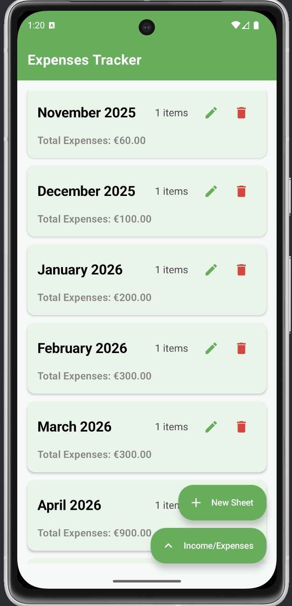
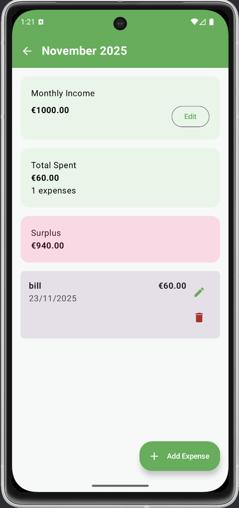
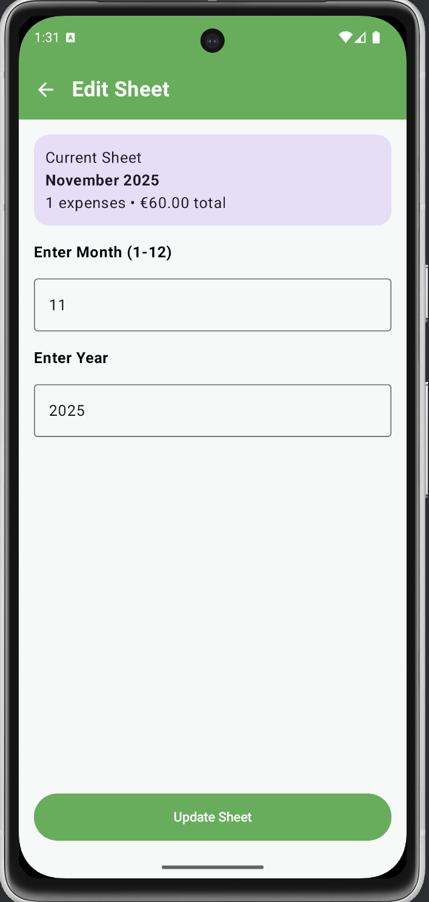
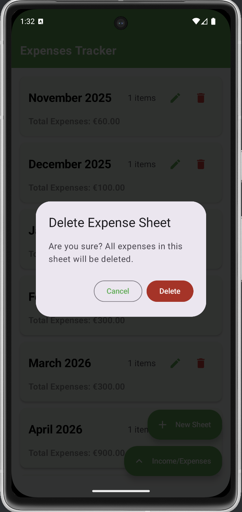
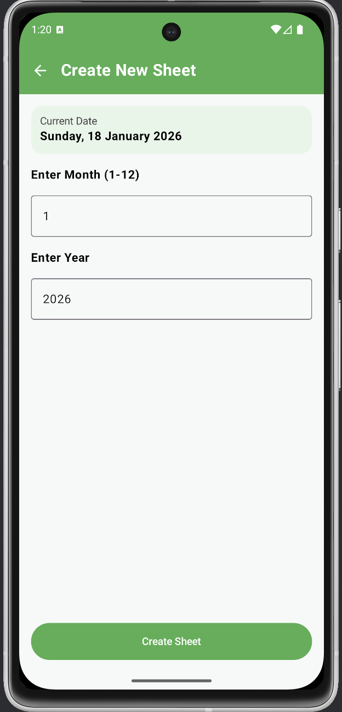
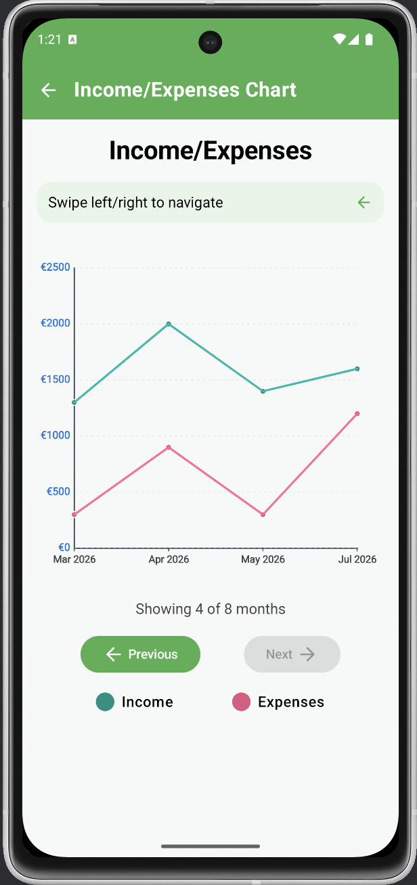

# 📱 Expenses Tracker

Expenses Tracker is an Android application built using Kotlin and Jetpack Compose that helps users manage monthly income and expenses.  
The app allows users to create expense sheets, record daily spending, analyze financial patterns, and view graphical reports. All data is stored locally using **SQLite**, making the app fully offline and secure.

---

## 📌 Project Overview

- Create and manage monthly expense sheets  
- Add, edit, and delete individual expenses  
- Track total income vs total expenses  
- View balance for each month  
- Visualize financial trends with charts  
- Prevent duplicate month entries  
- Works completely offline

---

## 🛠 Tech Stack

- Language: Kotlin  
- UI: Jetpack Compose  
- Database: SQLite  
- Architecture: Modular / MVVM style  
- Tools: Android Studio, Gradle

---

## 🧩 Application Structure

### MainActivity.kt
- Initializes database and app components  
- Defines core data models  
- Handles app lifecycle and navigation

### SharedComposables.kt
- Contains reusable UI components  
- Screens for creating, editing, deleting sheets  
- Dialogs for expense operations

### MonthActivity.kt
- Displays detailed monthly information  
- Income update and expense management  
- Real-time UI refresh

### ChartActivity.kt
- Line chart comparison of income vs expenses  
- Swipe navigation between months

### DBHelper.kt
- All SQLite CRUD operations  
- Referential integrity  
- Data retrieval and calculations

---

## 🚀 Features

- Monthly expense sheets  
- Expense CRUD operations  
- Income management  
- Balance calculation  
- Line chart visualization  
- Duplicate sheet prevention  
- Offline data storage

---

## ▶ How to Run

1. Clone the repository  
2. Open project in Android Studio
3. Sync Gradle files  
4. Run on emulator or physical device

---

## 📸 Screenshots

### Home Screen

### Add Expense Screen

### Edit Expense

### Delete Sheet

### Create Sheet

### Chart View

---

## 💡 Skills Demonstrated

- Kotlin Android Development  
- Jetpack Compose UI  
- SQLite Database Handling  
- CRUD Operations  
- Data Visualization  
- Modular Architecture  
- Git & GitHub Workflow

---

## 📄 Documentation

The project design and architecture follow structured principles including modular UI, SQLite data persistence, and reactive Jetpack Compose components :contentReference[oaicite:1]{index=1}.

---

## Future Improvements

- Expense categories  
- PDF / CSV export  
- Cloud backup  
- Budget limit alerts  
- Dark mode
